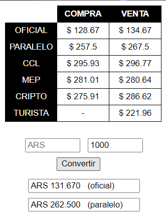

# DolarConversor
Muestra el valor en tiempo real de la cotizacion de compra y venta en Argentina del:
- dolar oficial
- dolar paralelo
- dolar CCL
- dolar MEP
- dolar turista/solidario
- dolar cripto

Tiene conversor de divisas:
- ARS / USD oficial
- ARS / USD parelelo
y viceversa.

  

_Descargalo e instalalo desde el **[Chrome Web Store](https://chrome.google.com/webstore/detail/dolar-conversor/gkolbkbpbmedmcnfpeacflkinchhoegg)**_
